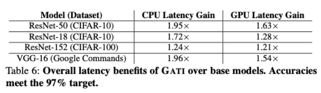

# Deeply Learned Caches: An Optimization for Deep Learning Inference

## Names and SUNet ID: 
	- Clemente Farias (cbfarcan)
	- Erik Luna (eluna1)

## Summary: 
We want to accelerate DNN inference times by re-creating a hierarchy of simple ML models to function as a cache during runtime. This system of ML models, called GATI, uses intermediate DNN layer outputs to predict final inference outputs and drastically improves performance by having a dynamic simulated cache. We will test on their same base models for vehicle detection (ResNet-18, ResNet-34, ResNet-50) and for face detection (SE-LResNet18E-IR), and we will reimplement their RPC framework using either Apache Thrift or a variant in hopes of achieving their same speedup and performance.

## Research paper: 
Balasubramanian, A., Kumar, A., Liu, Y., Cao, H., Venkataraman, S., and Akella, A. 2021. Accelerating Deep Learning Inference via Learned Caches. arXiv:2101.07344 [cs.LG] (Jan. 2021), DOI: https://doi.org/10.48550/arXiv.2101.07344 

## Inputs:
  - Trained ResNet-18, etc. models
  - Dataset of training samples (images) to train the learned cache on
  - LFW dataset, Stanford cars dataset, and CIFAR-100 dataset

## Outputs:
  - Accuracy (compared to testing datasets) measurements  
  - Latency measurements

## Constraints: 
  - Complexity of the learned cache ML models which affects:
  - Performance/accuracy (must predict outputs correctly often enough to make it worth it)
  - ML Model latency (it must be fast enough to not delay each layer calculation)
  - Same CPU/GPU instances as in the paper

## Checklist: 
  - Download the trained models and datasets from open-source sites. (Erik)
  - Investigate CPU and GPU implementations, decide which one to do based on our available computing resources. (Erik)
  - Investigate Apache Thrift and other RPC frameworks. (Clemente)
  - Implement the RPC system, and finish an end-to-end GATI system. (Clemente)
  - Test, measure latency and accuracy (Both)
  - Finish report (Both)

## Nice to Haves:
  - Evaluate design on CPU and a GPU, if we have enough time. 
  - Vary the hyperparameters to optimize performance, and possibly surpass their results. 

## Deliverables:
  - We will present the accuracy and latency measurements to the class. We plan on using visuals, like graphs and charts to help us present. We will compare latency vs performance for each of our models. We will provide illustrations for any part of the system design that we change from the paper. We will base the success of our implementation on whether it reaches and/or surpasses the latency gains from the paper, as shown below (ignore the Google Commands speech recognition task).
    

## Biggest risks: 
  - This is our first time developing in Apache Thrift for RPC’s. 
  - We are hoping that the retraining times are as fast as they say in the paper during inference time. This design latency is heavily dependent on the speed and accuracy of these models. 

## What do you need help with? 
  - Since the paper implements its system using specific AWS instances, we would like AWS credits to more closely replicate their implementation and limit independent variables.
  - We would appreciate advice on RPC frameworks or DAGs for DNNs, if the teaching team has any experience with them. 
